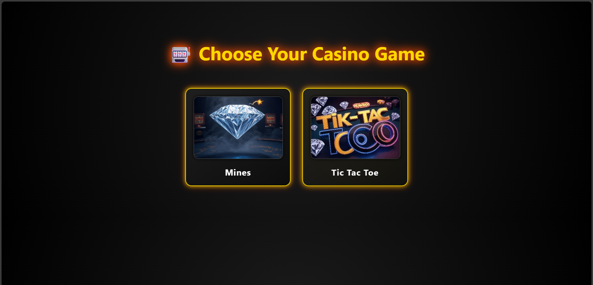
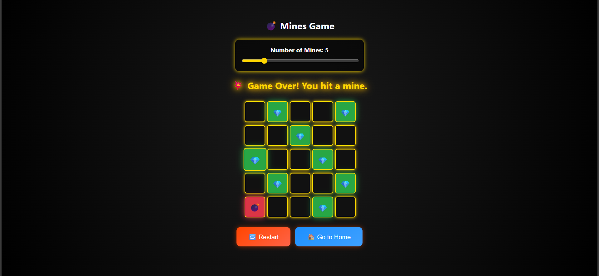
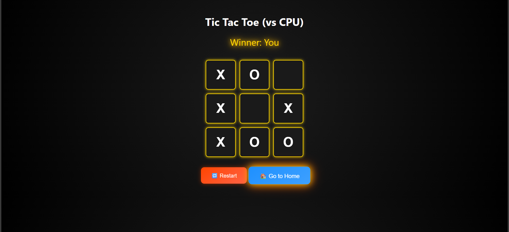

# 🎮 React Online Games

This project is a fun mini-game hub built using **React**. It includes two classic games:

- 🟢 **Tic Tac Toe**
- 💣 **Minesweeper**

Enjoy simple, engaging gameplay with a responsive and modern UI.

## 🚀 Features

- 🎲 Two games in one app
- ⚛️ Built with React
- 📱 Responsive design
- 🎨 Simple and clean UI

## 🛠️ Tech Stack

- React
- JavaScript
- CSS
- Vite

## 📂 Run Locally

Clone the project and run:

```bash
git clone https://github.com/yadav09anil/online-games.git
cd online-games
npm install
npm run dev

```
## 📸 Screenshots

Below are some screenshots of the Online Games website:

### 🏠 Home Page


### 🎮 Game Page 1


### 🎮 Game Page 2

